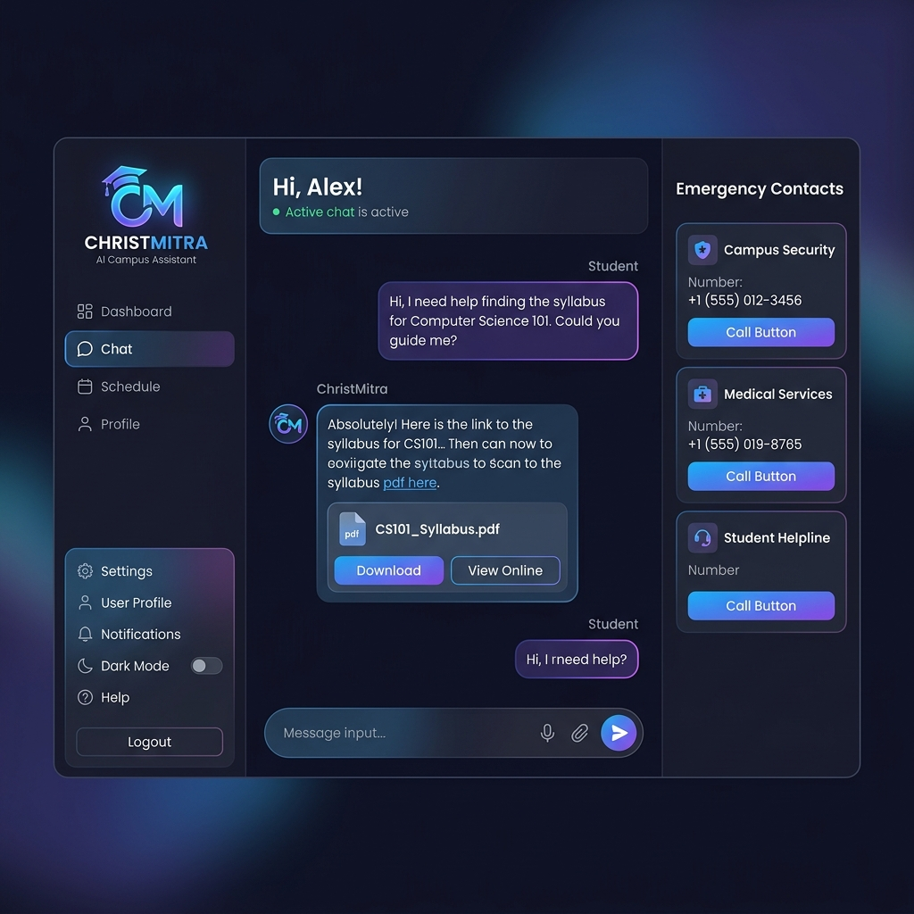
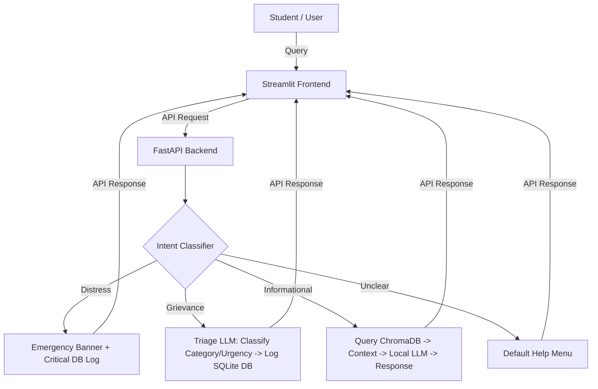

# 🎓 ChristMitra: Local College RAG Chatbot

ChristMitra is a fully-local, privacy-respecting, and intelligent campus assistant designed for **Christ University** students and faculty. It integrates local retrieval-augmented generation (RAG) with automated intent classification, grievance logging, and emergency safety guardrails.

---

## 🖥️ UI Screenshot



---

## ✨ Features

1. **Local Retrieval-Augmented Generation (RAG):** Answers queries about admission policies, campuses, department info, and hostel curfews using a vector store populated with university documentation. Powered by `nomic-embed-text` and `llama3.1:8b`.
2. **Campus-Specific Query Scope:** Filter queries to specific campuses (e.g., Central, Yeshwanthpur, Kengeri, Bannerghatta Road, Pune, Delhi NCR) or search across all campuses.
3. **Automated Grievance Triage & Ticketing:**
   - Detects when a student is filing a complaint or grievance.
   - Categorizes complaints (`academic`, `hostel`, `fee`, `other`).
   - Extracts severity levels (`low`, `medium`, `high`, `critical`) and generates summaries using the LLM.
   - Logs tickets to a persistent SQLite database for administrator review.
4. **Emergency / Distress Guardrails:** Immediately flags distress keywords (e.g., *ragging*, *harassment*, *suicide*) to bypass normal RAG flows and display critical contact numbers (Anti-Ragging Squad, POSH Internal Committee, Counselling Cell).
5. **Modern Premium Dashboard:** Built with Streamlit featuring a customized dark theme, glassmorphism card components, and an integrated sidebar displaying current ticket queues.

---

## 🏗️ Architecture



---

## 🚀 Quick Start Guide

### Prerequisites
- Python 3.10+
- [Ollama](https://ollama.com/) running locally.
- Installed Ollama Models:
  ```bash
  ollama pull llama3.1:8b-instruct-q4_K_M
  ollama pull nomic-embed-text
  ```

### 1. Installation
Clone the repository and install dependencies:
```bash
pip install -r requirements.txt
```

### 2. Document Ingestion
To populate the vector database with university PDFs or output files, place your raw text/HTML documents under your data folder and run:
```bash
python -m ingest.embed_and_store
```

### 3. Start Backend Services
Start the FastAPI server:
```bash
uvicorn app.main:app --host 0.0.0.0 --port 8000 --reload
```

### 4. Run the Streamlit Interface
In a separate terminal tab, run the Streamlit app:
```bash
streamlit run frontend/streamlit_app.py
```

---

## 🛠️ Tech Stack
- **Frontend:** Streamlit
- **Backend API:** FastAPI, Uvicorn
- **Vector DB:** ChromaDB
- **Database:** SQLite (chat history logs & grievance tickets)
- **Local LLM Orchestrator:** Ollama
- **Models:** Llama 3.1 & Nomic Embed Text
